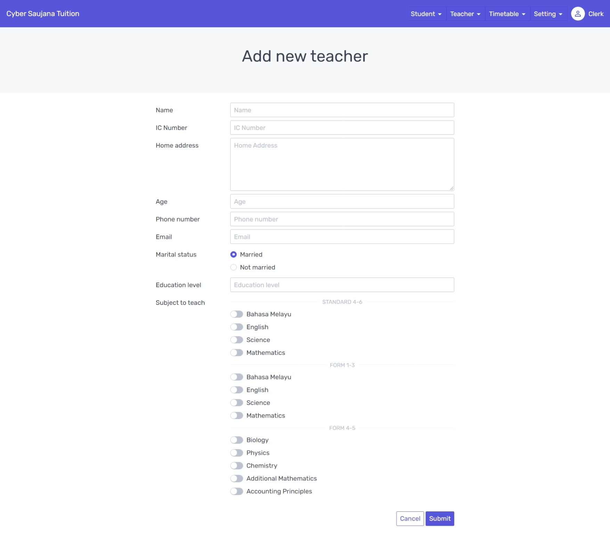

## **Tuition Management System**
Tuition Management System is a system developed for Tuition Centre. This system will help them for a better managing the students and the teachers.   

To test this website locally, you need to have [Node.js](https://nodejs.org/en/) installed on your local machine. Then, kindly download the zip file of the source code. After extract the folder, open the terminal and type

```Shell
	npm install
	// This will install all the dependencies of the project
```


To after install all dependencies, to test this website in development mode, then type

```Shell
  	npm run dev
```


To bundle and compile all Svelte files into JavaScript, then type

```Shell
  	npm run build
```


After that, the `/dist` folder will be created. Then to test this website in preview/production mode, then type

```Shell
  	npm run preview
```


## **Main Purpose**
This system is mainly purposes for the project in BIE 20103 Requirement Engineering course in my university. For now, there is no real data integration to any backend. This website is only created from my team to enhance our knowledge about the requirement engineering concepts and principles.     


## **List of requirements to be fulfilled**     

1. Register student   
    

2. Register teacher     
      

3. Manage subject timetable      
      

4. Manage attendance      
      

5. Manage student fee     
     

6. Manage teacher salary record     
     
